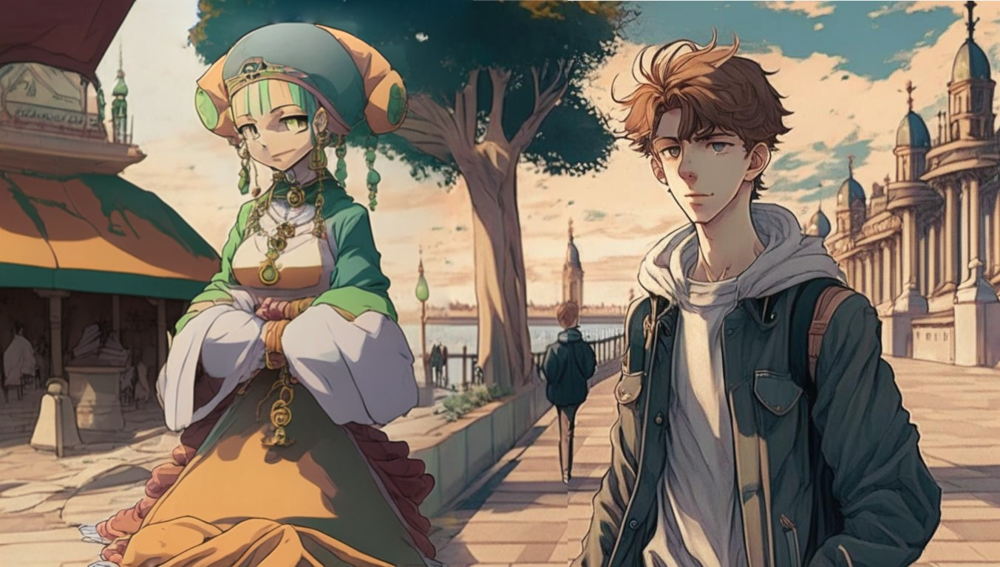
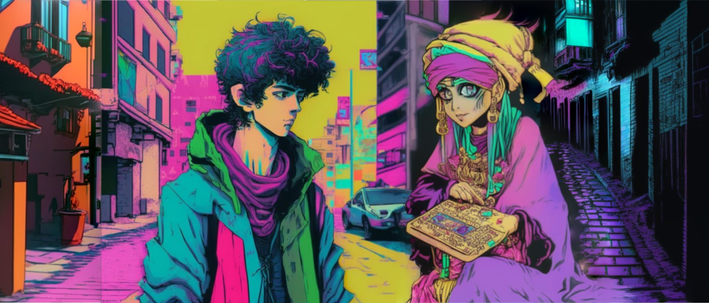
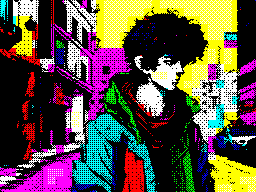
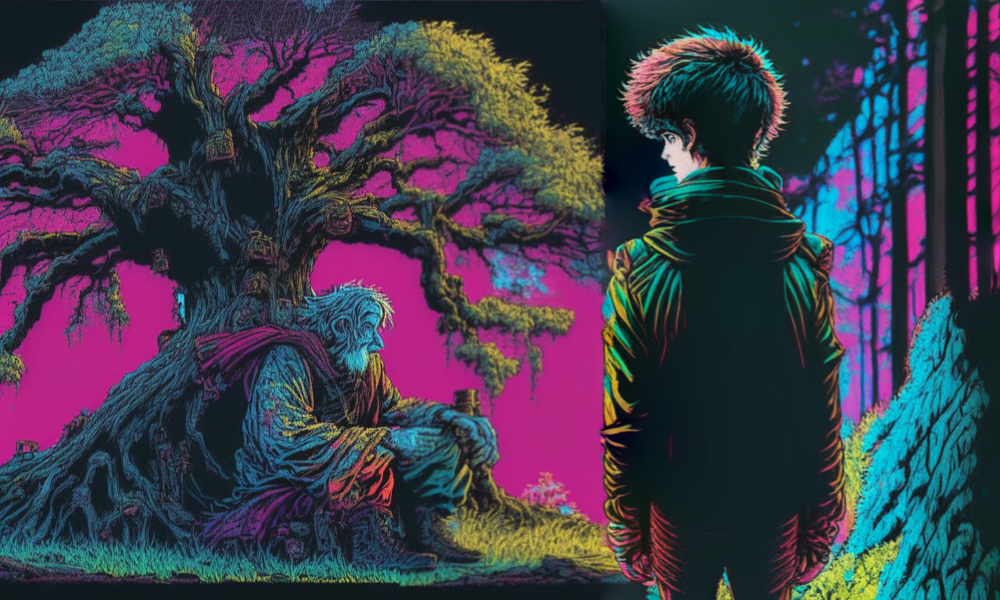

ZX Ren'ai
=====
[Open this project in 8bitworkshop](http://8bitworkshop.com/redir.html?platform=zx&githubURL=https%3A%2F%2Fgithub.com%2Fshadowlamer%2F9.9.9.9&file=main.c).

Уже второй раз участвую в [Yandex Retro Games Battle](https://rgb.yandex.ru/). Мог бы и три раза поучаствовать. 
Знаю о конкурсе с самого начала. [В первый раз](https://yandex.ru/museum/yrgb-2019/) поставил довольно амбициозную цель, сделать 3д-бродилку. 
Естественно, [не осилил](https://github.com/shadowlamer/chatnoir). [Второй раз](https://yandex.ru/museum/yrgb-2020/) вспомнил о конкурсе в ноябре. 
Поставил менее амбмциозную задачу - сделать хоть что-нибудь. В результате появилась, не побоюсь утверждать, 
[самая упоротая игра](https://github.com/shadowlamer/sixsixsixsix). На YRGBv3 я представил уже 
[более комплексную игрушку](https://github.com/shadowlamer/7.7.7.7). Идея была сделать весь геймплей в формате 
вертикального скроллера, сохранив немного упоротости предыдущей игры.

Какие выводы я сделал из участия? В игре главное не используемые технологии (привет BORSCH), а захватываюший 
сценарий, красивая графика и музыка. А вот с этим у меня не очень.

Но, теперь же есть нейронные сети. Почему бы не попробовать сделать ретроигру на основе контента, сгенерированного 
нейронными сетями? Попробую сделать демку в формате визуальной новеллы, чтобы обкатать процесс. 

Так что, если что-то не так, то это не я, это все нейронные сети...

## День первый.

Пробую быстро сгенерить пару картинок в «[Кандинском](https://editor.fusionbrain.ai/)» в режиме «аниме».


Школьник идет по улице


Школьник сидит за столом

Пробую перевести их в формат «Спектрума» при помощи утилиты [Dithretron](https://8bitworkshop.com/dithertron/), 
встроенной в 8bitworkshop.


Потянет для теста. Изображение занимает в памяти 6,5 килобайт из доступных примерно сорока. Значит влезет около 5 изображений. Маловато. Ищу какие есть архиваторы для Спектрума.  Нахожу ZX0 (https://github.com/einar-saukas/ZX0) от Einar Saukas. В лицензии написано, что разархиватор можно свободно использовать с указанием авторства. То, что нужно.


[Быстрый тест](https://github.com/shadowlamer/zxrenai/tree/aac7a10a7ecdb5b02182aa74d9eaa07167987aa4)

Размер картинки уменьшается до пары килобайт. Жить можно.

## День второй.

В автобусе по дороге на работу пытаюсь уговорить ChatGPT написать сценарий. Получилось на удивление неплохо практически с первой попытки.
```text
Я: Придумай сценарий для симулятора свиданий в Перми с отсылками к уральским мифам и легендам.

GPT: Название симулятора: "Легендарное свидание в Уральской столице"
Описание: В игре "Легендарное свидание в Уральской столице" игрок оказывается в роли молодого искателя приключений, который приехал в Пермь – город, пропитанный тайнами и уральскими мифами. Его цель – устроить романтическое свидание, постепенно раскрывая и изучая легенды этого замечательного места.
Сценарий:
1. Введение:
   Персонаж оказывается на улицах Перми, блуждая по узким улочкам и восхищаясь уникальной архитектурой города. Он встречает загадочную гадалку, которая предсказывает, что его ждет великое приключение, связанное с уральскими мифами и легендами. Возбужденный этой мыслью, герой начинает свое путешествие.
2. Первая легенда: "Златоуст и Шайтан-Камень":
   Герой знакомится с местным жителем, который рассказывает историю о Златоусте, магическом мече, способном побеждать зло, и Шайтан-Камне, волшебном камне, способном исполнить желания. Они отправляются в лабиринт подземных тоннелей, чтобы найти Шайтан-Камень, и герой получает возможность загадать желание.
3. Вторая легенда: "Гриб-чудо у пруда":
   Герой встречает народного сказителя, который рассказывает историю о грибе-чуде, который приносит удачу в любви. Вместе они отправляются на поиски этого волшебного гриба. Герой состязается с другими участниками в интеллектуальных и физических испытаниях, чтобы найти гриб-чудо и получить его силу привлекательности.
4. Третья легенда: "Водяной и его сокровища":
   Герой узнает о легенде водяного, живущего в близлежащем озере. Группа охотников за сокровищами предлагает свою помощь в поиске сокровищ, прячущихся на дне озера. Герой должен разгадать загадки, преодолеть испытания и проникнуть в жилище водяного, чтобы получить сокровище и подарить его возлюбленной.
5. Финальная часть:
   Герой, вернувшись в город, устраивает настоящее романтическое свидание на одной из пермских вершин, где можно насладиться прекрасным видом на город. Здесь он имеет возможность поделиться всеми приключениями, знаниями и сокровищами, которые собрал на протяжении игры. Он может выбрать любой из трех финалов, основываясь на своем опыте и желаниях героя: влюбиться, остаться друзьями или продолжить поиски новых уральских тайн.
Игра "Легендарное свидание в Уральской столице" предлагает игрокам не только насладиться романтикой и приключениями, но и узнать много интересного о уральских мифах и легендах, обогатив свои знания о регионе.

Я: Можешь придумать диалоги для первого пункта сценария?

GPT: Диалог 1:
Герой: (стоя на улице, изумленно разглядывает окружающую архитектуру) Вот это да, какие красивые здания! Это же Пермь, город с богатой историей.
Гадалка: (подходит к герою, загадочно улыбаясь) Здравствуй, молодой путешественник. Вижу, что ты ищешь что-то особенное.
Герой: (удивленно) Да, точно! Я хочу открыть для себя все тайны и легенды Перми. Я иду искать приключения!
Гадалка: (кивает) Мудрая цель, молодой человек. Слушай, у меня есть предчувствие, что тебя ждет великое свидание, связанное с уральскими мифами и легендами. Будь готов к невероятным приключениям!
Герой: (возбужденно) О, это звучит увлекательно! Я готов отправиться в этот удивительный мир легенд и мифов. Подскажи, с чего мне начать?
Гадалка: (тайнственно) Первая легенда рассказывает о Златоусте и Шайтан-Камне, магическом мече и волшебном камне, способных исполнить желания. Легенда гласит, что они спрятаны в одном из подземных лабиринтов. Найди меч и загадай желание – и будущее твое изменится.
Герой: (воодушевленно) Звучит увлекательно! Я отправлюсь в поиски Златоуста и Шайтан-Камня. Как я найду подземный лабиринт?
Гадалка: (улыбаясь) Лучше всего начать с Гороховой горы. Ищи там древнюю пещеру, вход в лабиринт должен быть рядом. Будь осторожен, уральские легенды полны опасностей, но твое стойкое сердце поможет тебе преодолеть все трудности!
Герой: (решительно) Спасибо за помощь! Я не остановлюсь, пока не найду Златоуста и Шайтан-Камень!

Я: Можешь придумать диалоги для второго пункта сценария?

GPT:  Диалог 2:
Герой: (подходит к старому дереву и видит старика-сказителя) Привет, дедушка! Слышал я, что ты знаешь легенду о грибе-чуде, приносящем удачу в любви. Расскажешь ее мне?
Старик-сказитель: (улыбается) Здравствуй, молодой искатель легенд! Да, моя история расскажет тебе о грибе-чуде. Итак, давным-давно...
Герой: (с интересом слушает)
Старик-сказитель: Этот гриб находится у пруда, который находится глубоко в лесу. Но чтобы найти гриб, тебе придется преодолеть испытания на пути. Ты готов сделать это?
Герой: (решительно) Конечно! Я готов пройти все испытания ради этого волшебного гриба! Какие меня ждут испытания?
Старик-сказитель: Первое испытание - интеллектуальное, тебе представят ряд загадок, которые нужно разгадать. Второе испытание - физическое, тебе предстоит преодолеть опасные препятствия и показать свою силу. И, наконец, третье испытание - духовное, придется открыть свое сердце и понять, что значит любовь.
Герой: (упорно) Я готов к любым испытаниям! Расскажи, как мне найти этот пруд? Куда мне идти?
Старик-сказитель: Добро, молодой искатель. Иди глубоко в лес, следуй по тропинке справа от старой ивы. Она приведет тебя к прекрасному пруду, где можно встретить гриб-чудо. Удачи тебе, смелый путник!

Я: Можешь придумать диалоги для третьего пункта сценария?

GPT: Диалог 3:
Герой: (подходит к берегу озера и видит старого охотника за сокровищами) Привет, доблестный охотник! Я слышал у вас здесь есть легенда о сокровищах, которые скрыты в озере. Расскажите мне об этом!Охотник: (улыбается) Здравствуй, смельчак! Да, это правда. У нас есть легенда об озерном водяном, который хранит сокровища в глубинах озера. Но чтобы их достать, придется пройти через испытания. Ты готов?Герой: (решительно) Конечно! Я готов сразиться с опасностями ради сокровищ водяного. Расскажи, какие испытания меня ждут? Охотник: Первое испытание - разгадать загадку, чтобы найти место, где хранятся сокровища. Второе испытание - плавание в самом глубоком месте озера, чтобы достигнуть подводного укрытия водяного. И, наконец, третье испытание - победить самого водяного в схватке силой и умом.Герой: (улыбается) Я не боюсь испытаний! Расскажи, как найти озеро и пройти все испытания?Охотник: Первое, иди по дороге на восток от города до перекрестка, где увидишь старый монастырь. Затем сверни налево и следуй по тропинке вдоль реки. Она приведет тебя к озеру. Там ты найдешь укрытие водяного и начнешь свое испытание. Удачи, отважный искатель сокровищ!

Я: Можешь придумать диалоги для финальной части?

GPT: Диалог 4:
Герой: (стоит на вершине горы, рядом со своей возлюбленной) Вот мы и здесь, на этой удивительной вершине. Это место, где все легенды Перми сходятся. Такие прекрасные виды!Любимая: (улыбаясь) Да, это поистине волшебное место. Но не меньшее волшебство происходило и с нами на протяжении всего этого времени.Герой: (взяв ее за руку) Ты права. На каждом шагу мы сталкивались с уральскими мифами и легендами. Мы прошли через испытания, нашли сокровища и даже загадали желания. Я благодарен тебе за то, что ты была со мной на этом пути.Любимая: (нежно) И я благодарна тебе за то, что ты воплощал все идеалы искателя приключений. Ты умеешь видеть прекрасное и не боишься преодолевать преграды. Мы вместе смогли почувствовать волшебство этого места.Герой: (взяв ее за руки и смотря ей в глаза) Хотя наше свидание было лишь симуляцией, но я понял, что наша связь настоящая. Мы прошли через многое вместе и создали собственную историю. Любимая, я хочу продолжить наше приключение и исследование мира вместе с тобой.Любимая: (счастливо) Я тоже хочу быть рядом с тобой, герой моего сердца. Наше свидание в мире уральских мифов и легенд прекрасно заканчивается, но перед нами множество новых глав, которые мы сможем написать вместе.Герой: (улыбается) Я рад услышать это. Наше приключение только начинается, и я уверен, что оно будет еще более захватывающим и незабываемым. Да здравствует наше будущее, полное любви и уральской магии!

Я: Придумай диалоги героев во время поисков Шайтан-Камня в подземном лабиринте?

GPT: 
Герой А: Уф, какой темный и запутанный лабиринт! Везде туннели ведут в разные стороны. Как ты думаешь, герой Б, куда нам нужно идти?
Герой Б: Не знаю точно, но давай попробуем этот туннель справа. У него есть какая-то странная аура.
Герой А: Хм, согласен. Вперед, надеюсь, мы найдем Шайтан-Камень скоро. Что-то мне подсказывает, что задача не такая простая.
(герои продвигаются по туннелю, но натыкаются на замок)
Герой Б: О нет, это замок! Как нам его открыть? Может быть, у нас есть что-то в инвентаре, что поможет?
Герой А: Давай проверим. (просматривает инвентарь)... Это да! У меня есть искра от Огненного Дракона. Попробуем воспламенить замок!
(герой А использует искру для открытия замка и они продолжают свой путь)
Герой Б: Слышишь это? Это звук водопада! Похоже, мы близки к месту, где Шайтан-Камень спрятан.
Герой А: Утренняя зарядка сработала, мы полны энергии! Давай поторопимся и проверим, что нас ждет за этим поворотом.
(герои двигаются в сторону звука водопада и находят Шайтан-Камень)
Герой Б: Вот он! Шайтан-Камень! У нас получилось! Мы завершили нашу миссию!
Герой А: Да, с вами рядом я чувствовал себя более смелым и уверенным. Никакой лабиринт не может нас остановить!
(герои празднующе возвращаются из подземного лабиринта с Шайтан-Камнем в руках)

Я: Придумай диалоги героев во время поисков чудо-гриба.

GPT: 
Герой А: Ну вот, мы уже на пути к чудо-грибу! Но эти лесные тропинки так запутаны. Как твои ощущения, герой Б?
Герой Б: Да, лабиринт леса просто поражает. Но я чувствую, что мы близки. Давай следовать по этой тропе, она выглядит более привлекательной.
Герой А: Хорошо, доверюсь твоему интуитивному чутью. Надеюсь, удача не оставит нас на этой опасной миссии.
(герои продолжают искать в лесу, сталкиваются с преградой в виде обвалившегося ствола дерева)
Герой Б: О нет, дорогу нам преградило это обвалившееся дерево. Как мы его обойдем?
Герой А: Если мы постараемся, можем попробовать его поднять вместе. Возможно, у нас будет достаточно сил, чтобы продолжить наш путь.
(герои совместными усилиями поднимают дерево и проходят)
Герой Б: Слышишь это? Чудо-гриб! Издали он выглядит таким красочным и величественным. Мы нашли его!
Герой А: Ух ты, действительно, это впечатляет. Не могу поверить, что мы нашли такой редкий экземпляр.
(герои осторожно собирают чудо-гриб и осторожно упаковывают его)
Герой Б: Мы сделали это! У нас в руках чудо-гриб, так редкий и ценный. Великолепная работа, партнер!
Герой А: Да, наша совместная усердная работа принесла результаты. Такое чувство, что мы способны преодолеть любые трудности вместе.
(герои победоносно возвращаются с чудо-грибом и радостно празднуют свою удачу)
```

Ну что ж. Начало положено. Для первой версии вполне достаточно.

В тот же день на работе в перерывах пытаюсь уговорить «Кандинского» рисовать картинки. Получается многообещающе.


«Кандинский» позволяет дорисовывать части в существующее изображение, так что можно разместить героев на общем фоне.



Пробую переводить в формат Спектрума.


Ну, такое... Возможно придется раскрашивать вручную.

Остаток дня в перерывах смотрю различные конвертеры изображений, читаю про [gigascreen и multicolor](https://ru.wikibooks.org/wiki/%D0%92%D0%B8%D0%B4%D0%B5%D0%BE%D1%80%D0%B5%D0%B6%D0%B8%D0%BC%D1%8B_ZX_Spectrum). Результат не радует.

## День третий.

Добавление к промпту «в палитре zx spectrum», позволяет получать картинки, которые после конвертации дают значительно более интересный результат.






[Быстрый тест со сменой кадров](https://github.com/shadowlamer/zxrenai/tree/a6b051034fc73f63b5a820ba74116d938e63be9d)

## День четвертый.

В автобусе по дороге на работу начинаю писать этот документ.

На работе в перерывах делаю процедуру для выода текста шрифтом переменного размера и шрифт к ней. 
Выясняется, что 8bitworkshop поддерживает кириллицу, но транслирует ее в странные коды. Порядок букв как в cp1251, 
но алфавит начинается с "а" = 0x10. Похоже, просто отбрасывает один байт юникода. Таким образом часть букв 
пересекается со знаками препинания. Приходится ескейпить знаки препинания.


[Быстрый тест](https://github.com/shadowlamer/zxrenai/tree/bc15d85c6fb8d4681925f474cda9df31f2ceca98)

## День пятый

Рефакторинг репозитория.

## День седьмой

Пытаюсь сгенерировать картинки для следующей сцены




